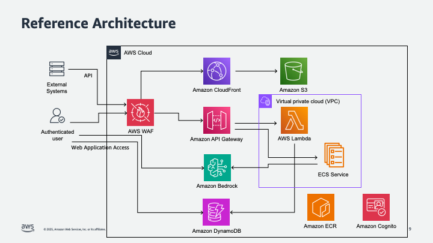

# Bedrock Chat Application

A demonstration chat application built with TypeScript that integrates Amazon Bedrock AI models, featuring a modern React and Tailwind CSS interface.

## Overview

This sample application demonstrates how to build an AI chat platform with tiered access to Amazon Bedrock language models. This is intended for proof-of-concept and demonstration purposes, showcasing:

### Authentication & Authorization
- Google OAuth and email-based authentication via Amazon Cognito
- Three-tier access system (Admin, Paid, and Free users)
- Secure token-based authentication flow
- Automated user verification and group assignment

### AI Model Integration
- **Admin & Paid Users**: 
  - Full access to all Amazon Bedrock models
  - Real-time streaming responses
  - Advanced model configuration options

### Data Management
- Personal conversation storage in Amazon DynamoDB
- Secure file attachments in Amazon S3
- Offline-first architecture with IndexedDB
- Real-time synchronization system

### Infrastructure
- Amazon CloudFront-powered content delivery
- Serverless architecture using AWS services
- Secure Amazon S3 bucket configuration
- Amazon DynamoDB-based data persistence

### Security Features
- Client-side data encryption
- AWS IAM role-based access control
- Secure credential management
- Protected API endpoints
- HTTPS-only access

### User Experience
- Responsive design
- Dark mode support
- Rich text formatting
- Real-time streaming responses

## Technology Stack

### Frontend Framework
- **Core**: React 18+
- **Language**: TypeScript
- **Styling**: 
  - Tailwind CSS for utility-first styling
  - Geist typography for modern UI
  - Custom dark mode implementation
- **State Management**: React Context API
- **Text Editor**: ProseMirror for rich text handling
- **Local Storage**: IndexedDB for offline data

### Cloud Services
- **AI Integration**: Amazon Bedrock - AI model integration
- **Content Delivery**: Amazon CloudFront - Content delivery
- **Storage**: Amazon S3 - Static and attachment storage
- **Authentication**: Amazon Cognito - Authentication and authorization
- **Database**: Amazon DynamoDB - Data persistence
- **Compute**: AWS Lambda - Serverless functions

### Authentication & Authorization
- **Identity Provider**: 
  - Amazon Cognito User Pools
  - Google OAuth 2.0 integration
  - Email-based verification
- **Access Control**:
  - Amazon Cognito Identity Pools
  - AWS IAM role-based authorization
  - Tiered access system (Admin/Paid/Free)

### Security Implementation
- **Authentication Flow**:
  - OAuth 2.0 protocol
  - JWT token handling
  - Refresh token rotation (30 days)
  - Access token lifecycle (1 hour)

- **Authorization**:
  - Fine-grained IAM policies
  - Resource-level access control
  - User-specific data isolation
  - Least privilege principle

- **Data Protection**:
  - HTTPS-only access
  - Amazon S3 bucket encryption
  - Amazon DynamoDB encryption at rest
  - Secure credential management

### Development Tools
- AWS SAM for infrastructure deployment
- TypeScript for type safety
- Tailwind CSS for styling
- React for UI components

This sample application provides a demonstration of secure, scalable AI-powered conversations for proof-of-concept and learning purposes.

## Architecture Design

### High Level Design


And here's a cloud deployment diagram:




And here's a system architecture diagram:


Flow Explanation:

1. **Initial Application Load**:
   - User accesses the application through Amazon CloudFront
   - Amazon CloudFront serves the React SPA from Amazon S3

2. **Authentication Process**:
   - User clicks "Sign in with Google"
   - App redirects to Google authentication
   - Google returns OAuth code to Amazon Cognito
   - Amazon Cognito exchanges code for tokens
   - Tokens are stored in the React app

3. **Chat Operation**:
   - React app exchanges Amazon Cognito tokens for temporary AWS credentials
   - App uses these credentials to make authenticated calls to Amazon Bedrock
   - Amazon Bedrock processes requests and returns AI responses
   - React app displays responses to user

4. **Security Components**:
   - Amazon CloudFront provides secure content delivery
   - Amazon Cognito manages user authentication
   - AWS IAM roles control access to AWS services
   - Temporary credentials ensure secure API calls

5. **Key Security Features**:
   - No permanent AWS credentials in browser
   - Time-limited temporary credentials
   - Scoped AWS IAM permissions
   - Secure token exchange
   - Protected Amazon S3 bucket access

### Sync System Architecture


### Project Structure & Components

```
bedrock-chat/
├── src/
│   ├── app/
│   │   ├── layout.tsx              # Root layout with metadata
│   │   ├── ClientLayout.tsx        # Client-side layout wrapper
│   │   └── metadata.ts             # App metadata configuration
│   ├── components/
│   │   ├── ConversationSidebar.tsx # Chat sidebar management
│   │   ├── MessageList.tsx         # Message display handling
│   │   └── template.tsx            # Loading states and templates
│   ├── providers/
│   │   ├── CredentialsProvider.tsx # AWS credentials context
│   │   ├── ConversationProvider.tsx # Chat state management
│   │   └── SettingsProvider.tsx    # App settings context
│   ├── hooks/
│   │   ├── useSettings.ts          # Settings management hook
│   │   └── useConversations.ts     # Conversation state hook
│   ├── types/
│   │   └── index.ts                # TypeScript definitions
│   └── utils/
        └── db.ts                   # IndexedDB interactions
```

### Key Architecture Features:
- Client-side only architecture (SPA)
- Secure credential management using IndexedDB
- Real-time streaming responses from Amazon Bedrock
- Amazon CloudFront distribution for optimal content delivery
- ProseMirror-based rich text handling
- Dark mode support with CSS variables

## Components Design

### Core Components:

1. **Layout (`layout.tsx`)**
   - Implements Geist typography
   - Manages providers hierarchy
   - Handles responsive layout
   - Dark/light mode support

2. **ConversationSidebar (`ConversationSidebar.tsx`)**
   - Conversation list management
   - Create/delete conversations
   - Active conversation tracking
   - Title editing capability

3. **Message Display (`MessageList.tsx`)**
   - ProseMirror document rendering
   - Message role-based styling
   - Streaming content updates
   - Code block support

4. **Header Actions (`HeaderActions.tsx`)**
   - Region switching functionality
   - Authentication management
   - Dynamic model region support

5. **Loading States (`template.tsx`)**
   - Skeleton loading animations
   - Progressive content loading
   - Responsive placeholder design

This architecture ensures:
- Type safety through TypeScript
- Component reusability
- Efficient state management
- Responsive design principles
- Secure credential handling
- Optimal user experience

All these components are styled using Tailwind CSS, with custom configurations defined in `tailwind.config.js` and global styles in `globals.css`.

### Data Synchronization Architecture

The application implements a robust offline-first synchronization system with the following components:

1. **SyncManager**
   - Coordinates sync operations
   - Manages sync state
   - Handles conflict resolution

2. **SyncQueue**
   - Manages pending operations
   - Implements retry logic
   - Persists queue state

3. **Storage Layer**
   - IndexedDB for local storage
   - Amazon DynamoDB for remote metadata
   - Amazon S3 for large content storage

4. **Conflict Resolution**
   - Version-based detection
   - Timestamp-based resolution
   - Bidirectional sync support


## Usage

### Prerequisites
- AWS Account with appropriate permissions
- AWS CLI installed and configured
- Node.js 16+
- Google OAuth credentials (Client ID and Secret)

### Deployment Parameters

The following parameters are required for deployment:

| Parameter | Description |
|-----------|-------------|
| BucketName | Name of the S3 bucket to store the SPA files |
| GoogleClientId | Google OAuth Client ID for authentication |
| GoogleClientSecret | Google OAuth Client Secret for authentication |
| AdminEmail | Email address of the admin user |

### Deployment Steps

1. **Prepare deployment parameters**:
   ```bash
   # Create parameters.json file
   cat > parameters.json << EOF
   [
     {
       "ParameterKey": "BucketName",
       "ParameterValue": "your-app-bucket-name"
     },
     {
       "ParameterKey": "GoogleClientId", 
       "ParameterValue": "your-google-client-id"
     },
     {
       "ParameterKey": "GoogleClientSecret",
       "ParameterValue": "your-google-client-secret"
     },
     {
       "ParameterKey": "AdminEmail",
       "ParameterValue": "admin@yourdomain.com"
     }
   ]
   EOF
   ```

   **Alternative CLI approach:**
   ```bash
   # Or deploy with inline parameters
   sam deploy --guided \
     --parameter-overrides \
       BucketName=your-app-bucket-name \
       GoogleClientId=your-google-client-id \
       GoogleClientSecret=your-google-client-secret \
       AdminEmail=admin@yourdomain.com
   ```

2. **Deploy the stack**:
   ```bash
   sam build
   sam deploy --guided --parameter-overrides file://parameters.json
   ```

3. **Post-deployment setup**:
   ```bash
   # Configure Cognito post-confirmation trigger (use command from stack outputs)
   aws cognito-idp update-user-pool \
     --user-pool-id <USER_POOL_ID> \
     --lambda-config "PostConfirmation=<LAMBDA_ARN>" \
     --auto-verified-attributes "email" \
     --region <REGION>
   ```

### Stack Outputs

After deployment, the following outputs are available:

| Output | Description |
|--------|-------------|
| UserPoolId | ID of the Cognito User Pool |
| UserPoolClientId | ID of the Cognito User Pool Client |
| IdentityPoolId | ID of the Cognito Identity Pool |
| CognitoDomainName | Cognito Domain Name for authentication |
| BucketName | Name of the S3 bucket |
| CloudFrontDistributionId | ID of the CloudFront distribution |
| CloudFrontDomainName | Domain name of the CloudFront distribution |
| AgentsTableName | Name of the Agents DynamoDB table |
| ConversationsTableName | Name of the Conversations DynamoDB table |
| AttachmentsBucketName | Name of the S3 bucket for attachments |

### Access Levels

The application supports three user tiers:

1. **Admin Users**:
   - Full Amazon Bedrock model access
   - User management capabilities
   - Complete Amazon DynamoDB and Amazon S3 access
   - Amazon Cognito user administration

2. **Paid Users**:
   - Full Amazon Bedrock model access
   - Personal Amazon DynamoDB and Amazon S3 access
   - No administrative capabilities

3. **Free Users**:
   - Limited to Llama 3 2.1B model
   - Personal Amazon DynamoDB and Amazon S3 access
   - Basic functionality only

### Infrastructure Components

The deployment creates:

- **Storage**:
  - Amazon S3 bucket for static files
  - Amazon S3 bucket for attachments
  - Amazon DynamoDB tables for agents and conversations
  
- **Authentication**:
  - Amazon Cognito User Pool with Google OAuth
  - Amazon Cognito Identity Pool
  - AWS IAM roles for different user tiers
  
- **Content Delivery**:
  - Amazon CloudFront distribution
  - Origin Access Control
  
- **Processing**:
  - Post-confirmation AWS Lambda function

### Environment Configuration

After deployment, create a `.env.local` file with the outputs:

```bash
NEXT_PUBLIC_REGION=<your-region>
NEXT_PUBLIC_USER_POOL_ID=<UserPoolId>
NEXT_PUBLIC_USER_POOL_CLIENT_ID=<UserPoolClientId>
NEXT_PUBLIC_IDENTITY_POOL_ID=<IdentityPoolId>
NEXT_PUBLIC_COGNITO_DOMAIN=<CognitoDomainName>
NEXT_PUBLIC_AGENTS_TABLE=<AgentsTableName>
NEXT_PUBLIC_CONVERSATIONS_TABLE=<ConversationsTableName>
NEXT_PUBLIC_ATTACHMENTS_BUCKET=<AttachmentsBucketName>
```

## Deployment

```bash
# Build and deploy with parameters
sam build
sam deploy --guided --parameter-overrides file://parameters.json

# Sync static assets to the created bucket
aws s3 sync ./out s3://$(aws cloudformation describe-stacks --stack-name <stack-name> --query 'Stacks[0].Outputs[?OutputKey==`BucketName`].OutputValue' --output text)

# Invalidate CloudFront cache
aws cloudfront create-invalidation \
  --distribution-id $(aws cloudformation describe-stacks --stack-name <stack-name> --query 'Stacks[0].Outputs[?OutputKey==`CloudFrontDistributionId`].OutputValue' --output text) \
  --paths "/*"
```