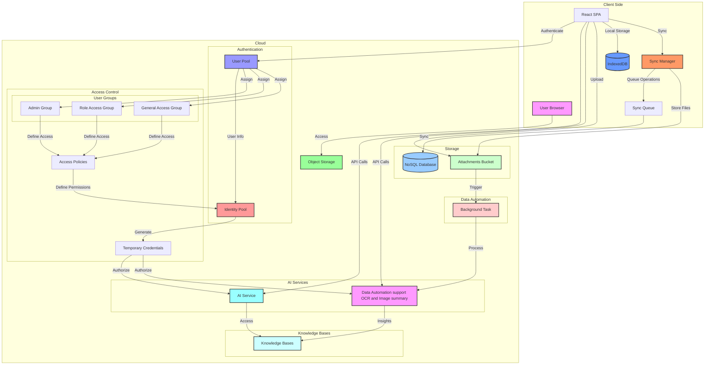
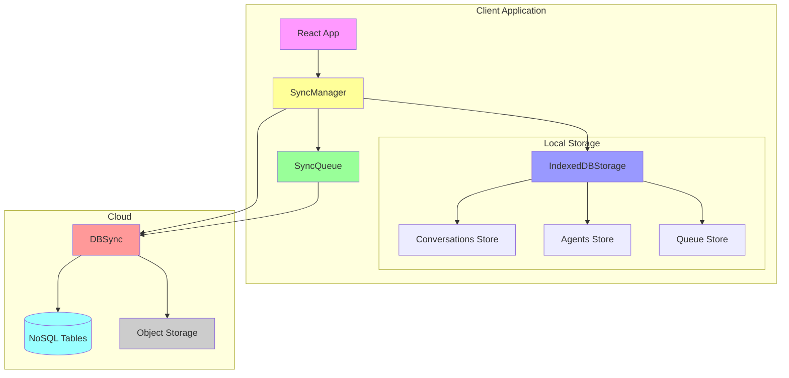

### High Level Design
Here's a system architecture diagram:

```mermaid
graph TB
    subgraph "Client Side"
        U[User Browser]
        R[React SPA]
        SM[Sync Manager]
        IDB[(IndexedDB)]
        SQ[Sync Queue]
    end

    subgraph "Cloud"
        S3[Object Storage]
        
        subgraph "Authentication"
            CUP[User Pool]
            CIP[Identity Pool]
        end
        
        subgraph "Storage"
            DB[(NoSQL Database)]
            AB[Attachments Bucket]
        end
        
        subgraph "AI Services"
            AI[AI Service]
            BDA[Data Automation support OCR and Image summary]
        end

        subgraph "Access Control"
            IAM[Access Policies]
            TC[Temporary Credentials]
            
            subgraph "User Groups"
                AG[Admin Group]
                RG[Role Access Group]
                GA[General Access Group]
            end
        end

        subgraph "Knowledge Bases"
            KB[Knowledge Bases]
        end

        subgraph "Data Automation"
            ECS[Background Task]
        end
    end

    U -->|Access| S3
    R -->|Authenticate| CUP
    CUP -->|User Info| CIP
    CIP -->|Generate| TC
    TC -->|Authorize| AI
    TC -->|Authorize| BDA
    IAM -->|Define Permissions| CIP
    R -->|API Calls| AI
    R -->|API Calls| BDA
    R -->|Upload| AB
    AB -->|Trigger| ECS
    
    R -->|Local Storage| IDB
    R -->|Sync| SM
    SM -->|Queue Operations| SQ
    SQ -->|Sync| DB
    SM -->|Store Files| AB
    
    CUP -->|Assign| AG
    CUP -->|Assign| RG
    CUP -->|Assign| GA
    AG -->|Define Access| IAM
    RG -->|Define Access| IAM
    GA -->|Define Access| IAM

    ECS -->|Process| BDA
    BDA -->|Insights| KB
    AI -->|Access| KB

    style U fill:#f9f,stroke:#333,stroke-width:2px
    style S3 fill:#9f9,stroke:#333,stroke-width:2px
    style CUP fill:#99f,stroke:#333,stroke-width:2px
    style CIP fill:#f99,stroke:#333,stroke-width:2px
    style AI fill:#9ff,stroke:#333,stroke-width:2px
    style BDA fill:#f9f,stroke:#333,stroke-width:2px
    style SM fill:#f96,stroke:#333,stroke-width:2px
    style IDB fill:#69f,stroke:#333,stroke-width:2px
    style DB fill:#9cf,stroke:#333,stroke-width:2px
    style KB fill:#cff,stroke:#333,stroke-width:2px
    style ECS fill:#fcc,stroke:#333,stroke-width:2px
    style AB fill:#cfc,stroke:#333,stroke-width:2px
```

### Sync System Architecture

```mermaid
graph TD
    subgraph "Client Application"
        A[React App] --> B[SyncManager]
        B --> C[SyncQueue]
        B --> D[IndexedDBStorage]
        
        subgraph "Local Storage"
            D --> D1[Conversations Store]
            D --> D2[Agents Store]
            D --> D3[Queue Store]
        end
    end
    
    subgraph "Cloud"
        E[DBSync]
        F[(NoSQL Tables)]
        G[Object Storage]
        
        E --> F
        E --> G
    end
    
    B --> E
    C --> E
    
    style A fill:#f9f
    style B fill:#ff9
    style C fill:#9f9
    style D fill:#99f
    style E fill:#f99
    style F fill:#9ff
    style G fill:#ccc
```
